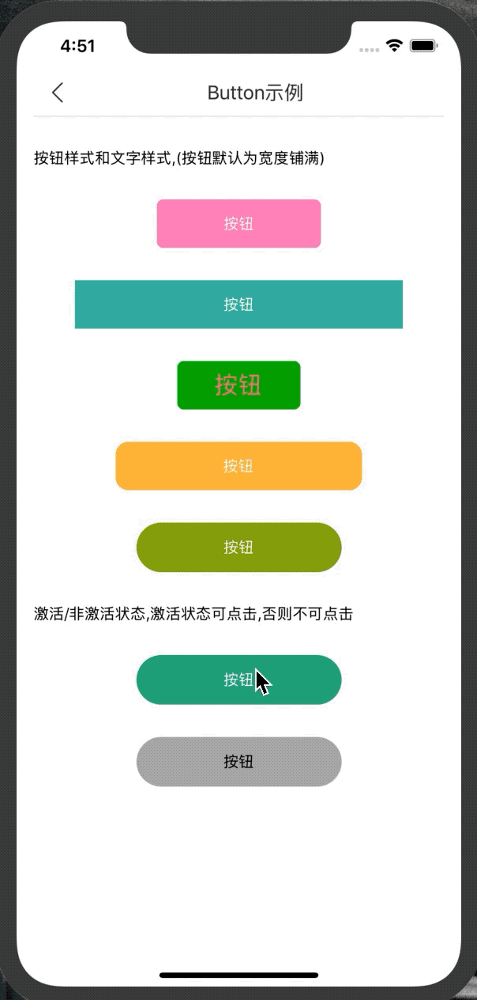

# Button

普通按钮组件,支持激活与非激活两种状态


### 引入

```jsx harmony
import {Button} from 'rn-collie'
```
### Example



### Code
[示例代码链接](../page/ButtonPage.js)

```jsx harmony
<Button
    style={{
        width: '50%',
        marginTop: 30,
        height: 46,
        borderRadius: 23,
    }}
    active={true}
    activeBackgroundColor={'#1e9d75'}
    inactiveBackgroundColor={'#7a7a7a'}
    activeColor={'#fff'}
    inactiveColor={'#000000'}
    text='按钮' onPress={() => {
    Toast.message("激活状态可点击");
}}/>
```


### Props
| Name | Type | Required | Default | Description |
| ---- | ---- | ---- | ---- | ---- |
| style | ViewStyle | false | {} | 按钮样式 |
| active | boolean | false | true | 激活状态 |
| activeBackgroundColor | string | false | ~ | 激活状态下的背景颜色 |
| inactiveBackgroundColor | string | false | ~ | 非激活状态下的背景颜色 |
| activeColor | string | false | ~ | 激活状态下的文字的颜色 |
| inactiveColor | string | false | ~ | 非激活状态下的文字的颜色 |
| text | string | true | ~ | 按钮的文字 |
| onPress | function | true | null | 按钮的点击回调 |
